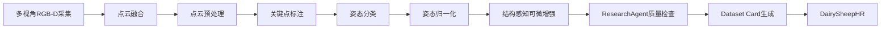
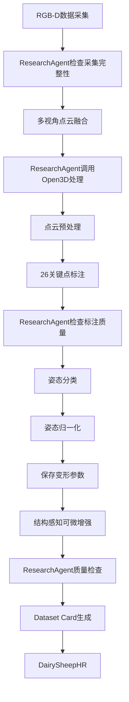
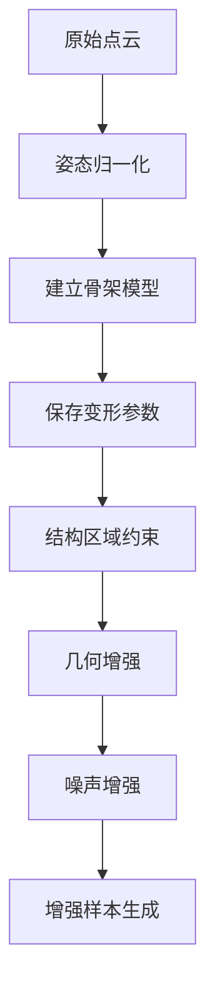

# ResearchAgent
## 面向高质量可微增强奶绵羊三维点云数据集构建的科研智能体

**Version:** V1.0

---

# Chapter 1 项目概述

## 1.1 项目背景

随着三维视觉、人工智能和大语言模型（Large Language Model，LLM）技术的快速发展，智能体（Agent）逐渐具备复杂任务规划、工具调用及知识管理能力。然而，目前大多数Agent主要应用于办公自动化、代码开发和智能问答等领域，在科研场景中的应用仍然较少，尤其缺乏针对三维点云数据集构建、实验管理及科研全过程辅助的智能体系统。

本项目围绕奶绵羊高质量可微增强三维点云数据集（DairySheepHR）的构建需求，设计并开发一个面向科研全过程的智能体——ResearchAgent。ResearchAgent以大语言模型为核心，结合Open3D、Whisper等专业工具，实现数据集构建、实验管理、论文阅读、组会管理及科研知识管理等功能，为三维点云数据处理和智能畜牧研究提供全流程智能辅助。

---

## 1.2 项目目标

ResearchAgent旨在构建一个能够贯穿科研全过程的智能体平台，并重点服务于DairySheepHR数据集的构建。

具体目标包括：

- 构建面向科研工作的智能体框架；
- 建立高质量奶绵羊三维点云数据集构建流程；
- 实现数据集自动检查与质量评估；
- 实现科研实验、论文阅读及组会管理自动化；
- 提高数据集构建效率及科研管理效率。

---

## 1.3 建设意义

ResearchAgent不仅是科研辅助工具，更是数据集构建全过程的智能调度平台。

通过引入Agent技术，将传统依赖人工完成的数据采集、数据管理、实验记录及组会总结等工作进行智能化管理，实现：

- 数据集构建流程标准化；
- 数据质量自动检查；
- 科研任务自动管理；
- 实验过程可追溯；
- 科研资料统一管理。

最终形成"数据集构建 + 科研管理 + 智能分析"一体化科研平台。

---

## 1.4 技术路线



---

# Chapter 2 总体架构

ResearchAgent采用模块化设计，以大语言模型为智能核心，各功能模块相互协作，实现科研全过程自动化。

```mermaid
graph TB

User

↓

ResearchAgent

↓

Dataset Agent
Meeting Agent
Paper Agent
Experiment Agent

↓

Tools

↓

OpenAI
Open3D
Whisper
Git
Pandas
PyTorch
```

ResearchAgent主要由四个核心Agent组成。

## 2.1 Dataset Agent

负责数据集构建全过程，包括：

- 数据集管理
- 点云管理
- 数据质量检查
- 数据统计
- Dataset Card生成
- 数据集版本管理

---

## 2.2 Meeting Agent

负责科研组会辅助，包括：

- 录音转文字
- 老师建议提取
- TODO生成
- 下一步工作规划
- 周报自动生成

---

## 2.3 Paper Agent

负责论文阅读辅助，包括：

- PDF解析
- 创新点总结
- 方法分析
- Related Work整理
- 文献知识管理

---

## 2.4 Experiment Agent

负责实验全过程管理，包括：

- 实验参数记录
- Loss统计
- MAE统计
- 实验日志管理
- 自动生成实验报告

---

# Chapter 3 ResearchAgent在DairySheepHR数据集构建中的作用

ResearchAgent贯穿整个DairySheepHR数据集构建流程，不直接完成算法计算，而是作为整个数据集构建流程的智能调度中心，协调各类工具及算法模块共同完成数据集构建任务。

整体工作流程如下：



在整个过程中，ResearchAgent承担以下职责：

### 数据集管理

负责：

- 数据目录检查；
- 文件完整性检查；
- 数据统计；
- 数据版本管理。

---

### 工具调度

根据当前任务自动调用：

- Open3D
- Python脚本
- Git
- Whisper
- OpenAI接口

完成对应任务。

---

### 科研管理

负责：

- 实验记录；
- 组会管理；
- TODO管理；
- 项目进度管理。

---

### 自动报告生成

自动生成：

- Dataset Report；
- Weekly Report；
- Experiment Report；
- Dataset Card。

---

# Chapter 4 DairySheepHR高质量可微增强数据集

## 4.1 数据集目标

构建一个高质量、高精度、支持可微增强的奶绵羊三维点云数据集，为三维体尺估计、姿态分析、点云补全及三维重建等任务提供统一的数据基础。

数据集具有以下特点：

- 高质量三维点云；
- 多姿态覆盖；
- 高精度关键点；
- 完整体尺真值；
- 支持姿态归一化；
- 支持结构感知可微增强；
- 支持多种下游任务。

---

## 4.2 数据集构建流程

```mermaid
graph TD

RGBD采集

-->

多视角点云融合

-->

点云预处理

-->

26关键点标注

-->

姿态分类

-->

姿态归一化

-->

结构感知可微增强

-->

数据质量检查

-->

Dataset Card

-->

DairySheepHR
```

---

## 4.3 数据采集

采用多视角RGB-D相机同步采集奶绵羊三维数据。

采集内容包括：

- RGB图像（仅采集阶段使用）；
- 深度图像（仅采集阶段使用）；
- 多视角点云；
- 相机标定信息；
- 羊只身份信息。

最终公开数据集仅保留融合后的三维点云，不保存原始RGB-D图像。

---

## 4.4 点云预处理

包括：

- 多视角点云融合；
- 点云去噪；
- 背景去除；
- 点云裁剪；
- 法向量计算；
- 坐标统一。

---

## 4.5 数据标注

建立完整标注体系。

包括：

### （1）26个关键点

覆盖：

- 头部
- 颈部
- 背部
- 四肢
- 臀部
- 尾部

用于姿态归一化及骨架建立。

---

### （2）姿态标签

包括：

- 标准站立
- 低头
- 抬头
- 左转
- 右转
- 行走
- 其他姿态

---

### （3）结构区域标签

根据解剖结构划分为：

- Head
- Neck
- Chest
- Abdomen
- Back
- Hip
- Left Foreleg
- Right Foreleg
- Left Hindleg
- Right Hindleg

用于结构感知可微增强。

---

### （4）体尺真值

人工测量：

- 体高
- 体长
- 胸围
- 胸宽
- 臀宽
- 臀高

作为监督学习标签。

---

## 4.6 数据集输出

最终数据集包括：

- 原始点云；
- 标准姿态点云；
- 关键点坐标；
- 姿态标签；
- 结构区域标签；
- 可微变形参数；
- 元数据；
- Dataset Card。

---

# Chapter 5 结构感知可微增强

## 5.1 模块目标

提出一种结构感知可微增强方法，在保持羊只几何结构一致性的基础上，实现姿态变化、几何变化及噪声模拟，为下游模型提供丰富且连续的数据增强能力。

---

## 5.2 整体流程



---

## 5.3 结构区域增强

依据结构区域标签，对不同部位采用不同增强策略。

包括：

- Head
- Neck
- Chest
- Abdomen
- Back
- Hip
- Foreleg
- Hindleg

保证不同区域增强过程符合真实生物结构。

---

## 5.4 几何可微增强

包括：

- Rotation（旋转）
- Translation（平移）
- Scale（缩放）

所有增强过程均保留可微参数。

---

## 5.5 噪声可微增强

模拟真实采集环境中的噪声，包括：

- Gaussian Noise
- Depth Noise
- Sensor Noise

提高模型的泛化能力。

---

## 5.6 姿态可微增强

基于26个关键点建立骨架模型，通过姿态归一化生成统一标准姿态，并保存姿态变形参数，实现不同姿态之间的连续可微变换。

主要保存：

- 骨架结构；
- 关节旋转参数；
- TPS变形参数（或其他姿态变形参数）；
- 全局刚体变换参数。

---

## 5.7 模块创新点

本模块具有以下创新特点：

1. 提出面向奶绵羊三维点云的结构感知可微增强框架；
2. 将姿态归一化与结构区域标签相结合，实现符合生物结构约束的数据增强；
3. 保存完整的姿态变形参数，为后续可微学习及姿态迁移提供支持；
4. 同时支持几何增强、噪声增强及姿态增强，提高数据集对多种下游任务的适用性。

---

# 总结

ResearchAgent以DairySheepHR高质量可微增强数据集构建为核心应用场景，将数据集管理、科研管理及智能分析有机结合，实现数据集构建全过程智能化，为三维点云智能分析及智能畜牧研究提供统一、高效、可扩展的科研智能体平台。